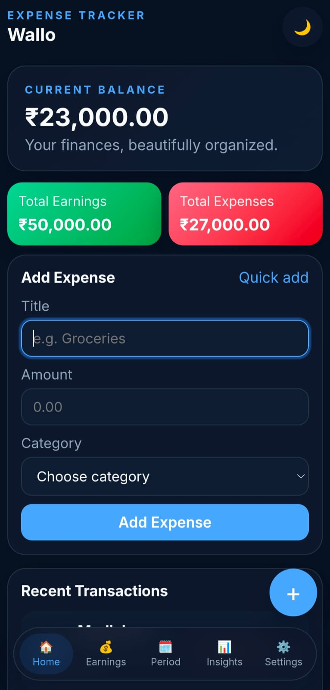
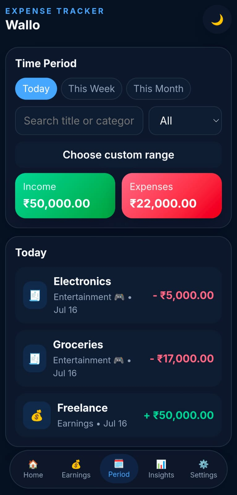
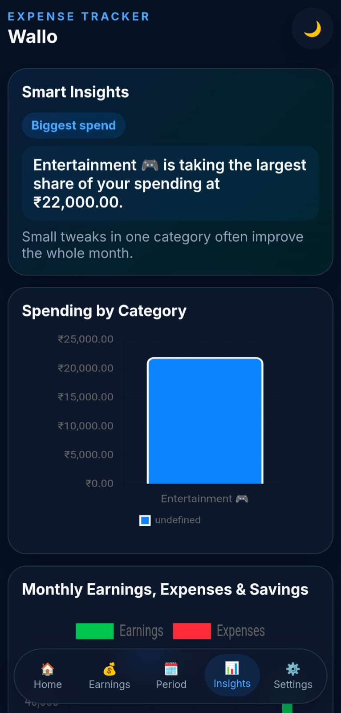
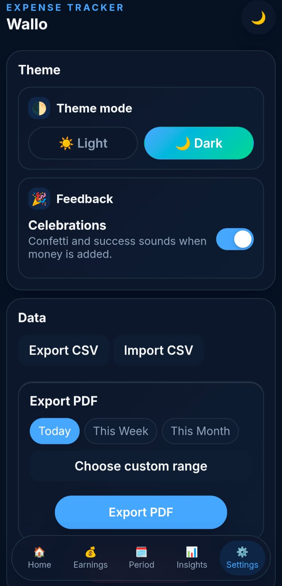

# Wallo 💸

**Modern & Minimal Expense Tracker** built with HTML, CSS & JavaScript


---

## About This Project

**Wallo** is a sleek, modern, and feature-rich expense tracker designed to make personal finance simple and intuitive.

Built with a focus on clean UI, smooth interactions, and insightful analytics, Wallo helps you keep track of your income and expenses while giving you a beautiful overview of your financial habits.

This project was built using **HTML, CSS, and JavaScript**, with development accelerated using **Claude Code✨📊**.

---

## ✨ Features

- 💸 Track income & expenses
- 📊 Interactive analytics with Chart.js
- 🧠 Smart financial insights
- 📅 Filter transactions by Today, Week, Month, or Custom Range
- 🔍 Search and filter transactions instantly
- 🎨 Light & Dark Mode
- 🌈 Multiple built-in color themes
- 🎨 Fully customizable theme colors
- 📄 Export data as CSV & PDF
- 📥 Import transactions from CSV
- 💾 Local Storage support (No account required)
- 📱 Fully responsive design
- ⚡ Smooth animations and micro-interactions
- 🎉 Optional celebration effects
- 🔊 Interactive UI sound effects

---

## 🚀 Live Demo

**🌐 Web App**
https://aryan-9907.github.io/wallo-expense-tracker/

**📦 Latest Release(APK)**
https://github.com/aryan-9907/wallo-expense-tracker/releases/latest

---
## 📸 Screenshots

<table>
  <tr>
    <td></td>
    <td></td>
  </tr>
  <tr>
    <td></td>
    <td></td>
  </tr>
</table>

---

## 🛠️ Technologies Used

- HTML5
- CSS3
- JavaScript (ES6)
- Chart.js
- Local Storage API

---

## 🚀 How to Run

### 1️⃣ Clone the Repository

```bash
git clone https://github.com/Aryan-9907/wallo.git
cd wallo
```

### 2️⃣ Open the Project

Simply open **index.html** in your browser.

Or, if you're using **VS Code**, install the **Live Server** extension and click **Go Live**.

---

## 📂 Project Structure

```
Wallo/
│
├── index.html
├── style.css
├── script.js
├── README.md
└── LICENSE
```

---

## 🌟 Future Improvements

- ☁️ Cloud Sync
- 👤 User Authentication
- 📱 Progressive Web App (PWA)
- 🌍 Multi-Currency Support
- 🤖 AI-powered Spending Insights
- 🎯 Budget Goals & Savings Tracker

---

## 🤝 Contributing

Contributions, ideas, and suggestions are always welcome!

Feel free to fork the repository and submit a pull request.

---

## 📄 License

This project is licensed under the **MIT License**.

---

<div align="center">

### ⭐ If you like this project, consider giving it a Star!

Made with ❤️ by **Aryan**

</div>
